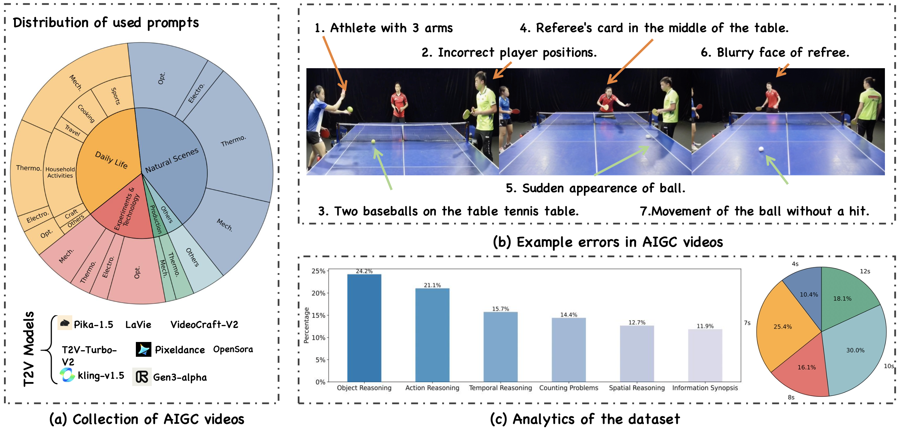

# VF-Eval

[](https://arxiv.org/abs/2505.23693)
[](https://huggingface.co/datasets/songtingyu/vf-eval/)

Official repository for the paper **VF-EVAL: Evaluating Multimodal LLMs for Generating Feedback on AIGC Videos**.



## 1. Preparation

```bash
pip install -r requirements.txt
```

set `.env` file as follows:
```
OPENAI_API_KEY=TODO
GEMINI_API_KEY=TODO
```

And please download the dataset from [HuggingFace](https://huggingface.co/datasets/songtingyu/vf-eval) and put it in the `data` folder. 
The step to prepare the dataset is as follows:
```sh
git clone https://huggingface.co/datasets/songtingyu/vf-eval.git
mkdir data
mv vf-eval data
cd data
unzip video.zip -d video-data
```

## 2. Inference

For a single model inference, you can use following code.
```sh
python main.py --model ${model_name} --max_num ${n_query} --total_frames ${n_frames} --data_path ${data_path} --prompt ${prompt}
```

`--max_num` is number of queries you want to infer.  `-1` means use all queries to inference. 

`--total_frames` marks how many frames to use. `-1` means use the whole video as input. 

`--prompt` means which prompt you want to use. 


## 3. Evaluation

As the process of **Inference**, you can run following code. 

```sh
python eval.py --prompt ${prompt} --model ${model} --frames ${n_frames}
```

## 4. Reproduction 
Run following code and it will reproduce the result in the paper.
```sh
sh scripts/inference.sh 
sh scripts/eval.sh
```

## 5. Reference
If you find this paper useful, feel free to cite it as follows:
```bibtex
@misc{song2025vfevalevaluatingmultimodalllms,
      title={VF-Eval: Evaluating Multimodal LLMs for Generating Feedback on AIGC Videos}, 
      author={Tingyu Song and Tongyan Hu and Guo Gan and Yilun Zhao},
      year={2025},
      eprint={2505.23693},
      archivePrefix={arXiv},
      primaryClass={cs.CV},
      url={https://arxiv.org/abs/2505.23693}, 
}
```